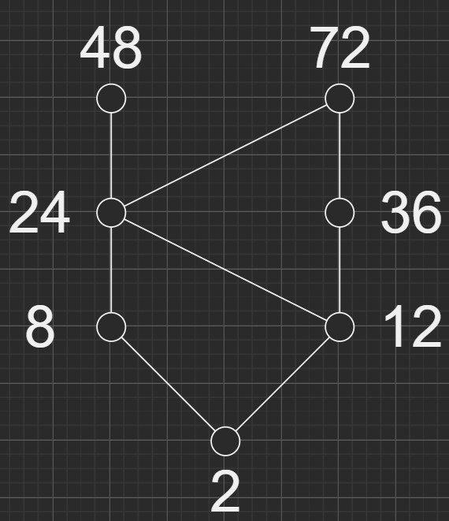
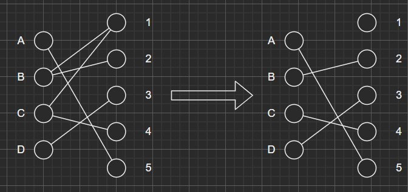

一、1、
$$
\begin{aligned}
&(\lnot p\rightarrow q)\and(r\or p)\\
\Leftrightarrow&(p\or q)\and(p\or r)\\
\Leftrightarrow&p\or(q\and r)\\
\Leftrightarrow&(m_4\or m_5\or m_6\or m_7)\or(m_3\or m_7)\\
\Leftrightarrow&m_3\or m_4\or m_5\or m_6\or m_7\\
\Leftrightarrow&M_0\and M_1\and M_2
\end{aligned}
$$
2、
$$
\begin{aligned}
A\Leftrightarrow&(p\and q)\or r\or r\\
\Leftrightarrow&p\and q\quad\or\quad r\\
\Leftrightarrow&(p\and q\and r)\or(p\and\lnot q\and r)\or(p\and q\and r)\or(\lnot p\and q\and r)\\&\or(p\and\lnot q\and r)\or(\lnot p\and\lnot q\and r)\\
\Leftrightarrow&m_1\or m_3\or m_5\or m_6\or m_7\\
\Leftrightarrow&M_0\and M_2\and M_4
\end{aligned}
$$
3、
$$
\begin{aligned}
(1)&P(S)=\{\varnothing,\{a\},\{b\},\{c\},\{d\},\\
&\qquad\qquad\{a,b\},\{a,b\},\{a,d\},\{b,c\},\{b,d\},\{c,d\},\\
&\qquad\qquad\{a,b,c\},\{a,b,d\},\{a,c,d\},\{b,c,d\},\{a,b,c,d\}\\
&\qquad\quad\}\\
(2)&R\circ R=\{<b,b>,<c,c>\}\\
&R^{-1}=\{<d,a>,<c,b>,<d,b>,<b,c>\}\\
&R\circ R^{-1}=\{<a,a>,<a,b>,<b,a>,<b,b>,<c,c>\}
\end{aligned}
$$
4、

> (1)、
> 
> (2)、最大元不存在，最小元为2，极大元为48与72，极小元为2
>
> (3)、下界：24、12、8、2，下确界：24

二、1、
$$
\begin{aligned}
构成。\\
封闭性：&\forall x,y(x,y\in Z\Rightarrow(x+y-5)\in Z),封闭性成立\\
结合性：&\forall x,y,z\in Z\\
&(x*y)*z=x+y+z-10=x*(y*z)\\
&\therefore结合性成立\\
单位元：&\forall x\in Z(x*5=x)\\
&\because5\in Z\\
&\therefore存在单位元5\\
逆元：&\forall x\in Z\\
&x*x^{-1}=x+x^{-1}-5=5\\
&解得x^{-1}=10-x,x^{-1}\in Z\\
&\therefore\forall x\in Z存在逆元x^{-1}=10-x\\
综上，&<Z,*>构成群
\end{aligned}
$$

2、
$$
\begin{aligned}
封闭性：&\forall x,y(x,y\in Z\Rightarrow(x+y-3)\in Z)\\
&\therefore封闭性成立\\
结合性：&\forall x,y,z\in Z\\
&(x*y)*z=x+y+z-6=x*(y*z)\\
&\therefore结合性成立\\
单位元：&\forall x\in Z(x*3=x)\\
&\because3\in Z\\
&\therefore存在单位元3\\
逆元：&\forall x\in Z\\
&x*x^{-1}=x+x^{-1}-3=3\\
&解得x^{-1}=3-x,x^{-1}\in Z\\
&\therefore\forall x\in Z存在逆元x^{-1}=3-x\\
交换性&\forall x,y\in Z\\
&\because x*y=x+y-3=y*x\\
&\therefore交换性成立\\
综上，&<Z,*>是交换群
\end{aligned}
$$

三、1、
$$
\begin{aligned}
符号化：&P:我学习\\
&Q:我热衷玩扑克\\
&R:我数学不及格\\
前提：&P\rightarrow\lnot R,\lnot Q\rightarrow P,R\\
结论：&Q\\
过程：&\\
&\begin{aligned}
&①&&R&前提引入\\
&②&&P\rightarrow\lnot R&前提引入\\
&③&&\lnot P&①②拒取式\\
&④&&\lnot Q\rightarrow P&前提引入\\
&⑤&&Q&③④拒取式\\
\end{aligned}
\end{aligned}
$$
2、
$$
\begin{aligned}
符号化：&P:江北大道发生了交通事故\\
&Q:小王的通行会发生困难\\
&R:小王按指定的时间到达\\
前提：&P\rightarrow Q,R\rightarrow\lnot Q,R\\
结论：&Q\\
过程：&\\
&\begin{aligned}
&①&&R&前提引入\\
&②&&R\rightarrow\lnot Q&前提引入\\
&③&&\lnot Q&①②假言推理\\
&④&&P\rightarrow Q&前提引入\\
&⑤&&\lnot P&③④拒取式\\
\end{aligned}
\end{aligned}
$$

3、
$$
\begin{aligned}
&\begin{aligned}
设&A:参加数学小组的人\\
&B:参加语文小组的人\\
&C:参加外语小组的人\\
\end{aligned}\\
&\begin{aligned}
&|A|=23,|B|=27,|C|=18,\\
&|A\cap B|=4,|B\cap C|=5,|A\cap C|=7,\\
&|A\cap B\cap C|=2\\
&|A\cup B\cup C|=|A|+|B|+|C|-|A\cap B|\\
&\qquad\qquad\qquad-|B\cap C|-|A\cap C|+|A\cup B\cup C|\\
&\qquad\qquad\quad=54
\end{aligned}\\
\end{aligned}\\
$$

4、

可以。如图：

5、
$$
\begin{aligned}
&节点度数分别为3,3,4,4,4\\
&\because有且只有2个奇度数节点\\
&\therefore存在b到c的欧拉通路\\
&\because欧拉通路是经过所有边的最短通路\\
&\therefore b到c最短，乙先到。
\end{aligned}
$$
