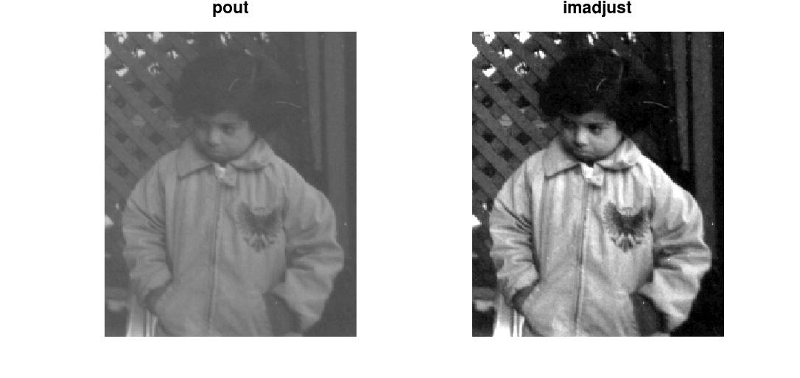
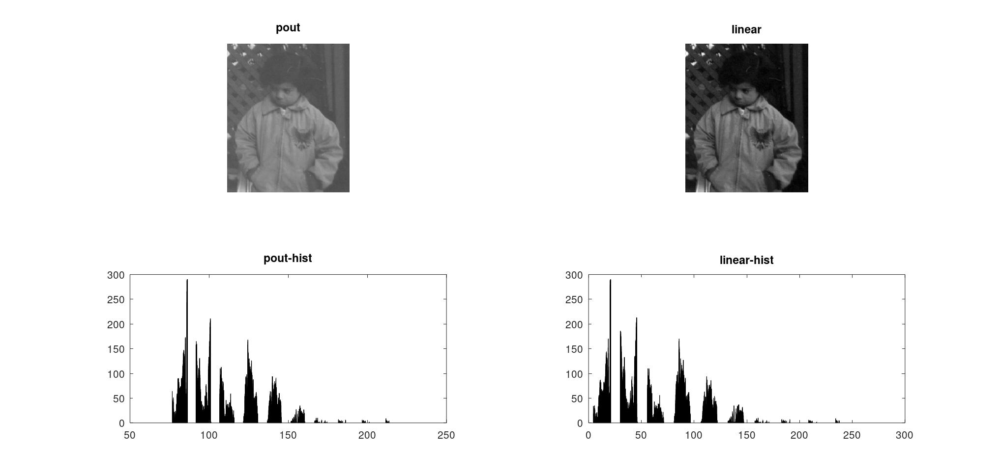
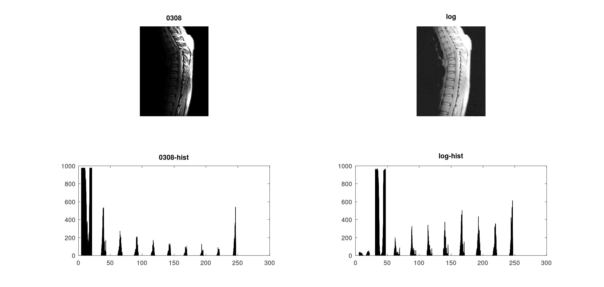
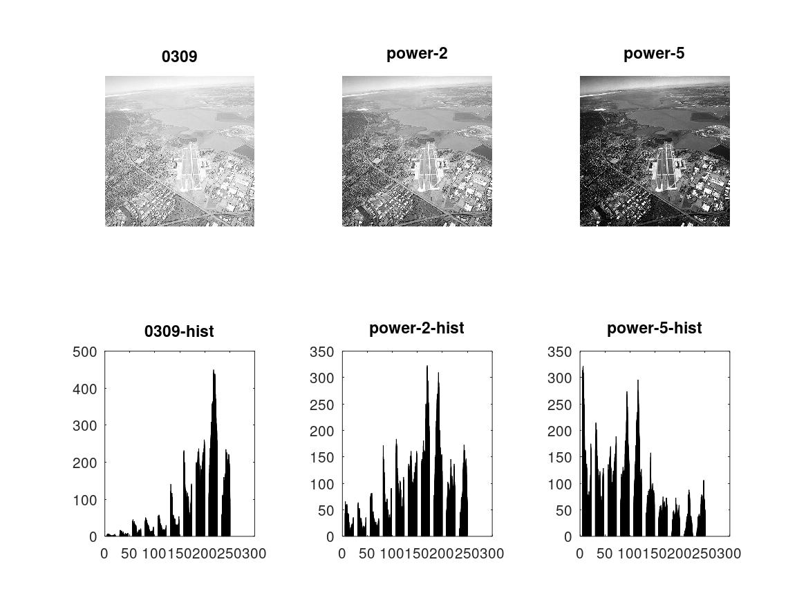
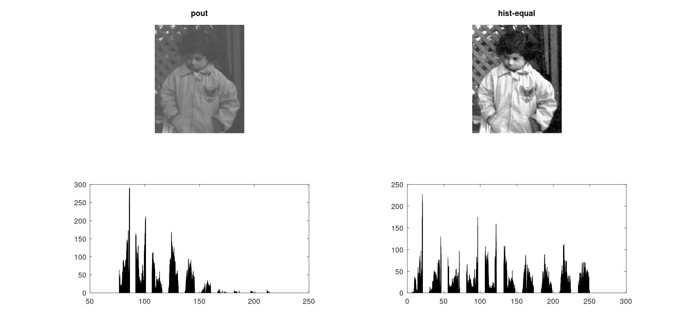

# 灰度变换及直方图均衡化算法实现

## 1. 图像灰度拉伸

```octave
pkg load image;
f=imread('pout.tif');
subplot(1,2,1);imshow(f);title('pout');
subplot(1,2,2);imshow(imadjust(f));title('imadjust');
```



## 2.实现图像线性灰度变换

```octave
f=imread('pout.tif');
a=min(min(f));
b=max(max(f));
g=uint8(double(f-a)/double(b-a)*255);
subplot(2,2,1);imshow(f);title('pout');
subplot(2,2,2);imshow(g);title('linear');
subplot(2,2,3);hist(f);title('pout-hist');
subplot(2,2,4);hist(g);title('linear-hist');
```



## 3.实现图像灰度对数变换、指数变换

```octave
f1=imread('0308.bmp');
g1=log(f1+1);
g1=uint8(g1*(255.0/max(max(g1)))+0.5);
subplot(2,2,1);imshow(f1);title('0308');
subplot(2,2,2);imshow(g1);title('log');
subplot(2,2,3);hist(f1);title('0308-hist');
subplot(2,2,4);hist(g1);title('log-hist');
```



```octave
f2=imread('0309.bmp');
g1=double(f2)/255.0;
g1=uint8(g1.^2*255+0.5);
g2=double(f2)/255.0;
g2=uint8(g2.^5*255+0.5);
subplot(2,3,1);imshow(f2);title('0309');
subplot(2,3,2);imshow(g1);title('power-2');
subplot(2,3,3);imshow(g2);title('power-5');
subplot(2,3,4);hist(f2);title('0309-hist');
subplot(2,3,5);hist(g1);title('power-2-hist');
subplot(2,3,6);hist(g2);title('power-5-hist');
```



## 4.实现直方图均衡化

```octave
f=imread('pout.tif');
[x,y]=size(f);
p=zeros([256,1]);
for i=f
	for j=i.'
		p(j+1)=p(j+1)+1;
	end
end
p=double(p)/double(x*y);
c=zeros([256,1]);
c(1)=p(1);
for i=2:256
	c(i)=c(i-1)+p(i);
end
c=round(c*255);
g=f;
for i=1:x
    for j=1:y
		g(i,j)=c(f(i,j)+1);
	end
end
subplot(2,2,1);imshow(f);title('pout');
subplot(2,2,2);imshow(g);title('hist-equal');
subplot(2,2,3);hist(f);
subplot(2,2,4);hist(g);
```

