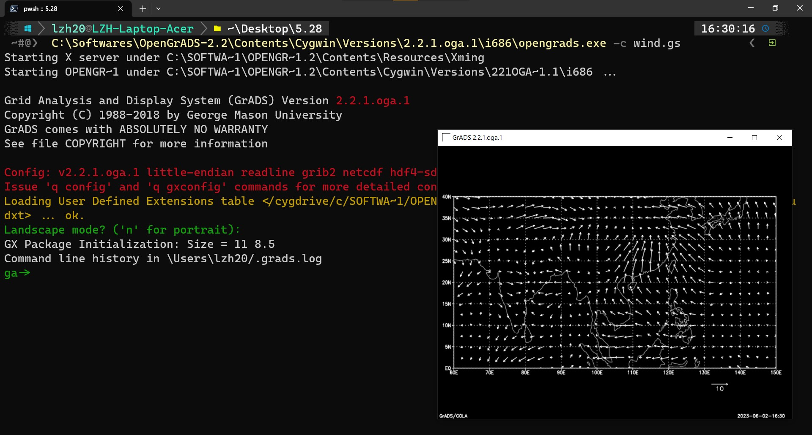

## 用Fortran生成grd数据文件

`wind.f90`

```fortran
program windplot
parameter(nx=37,ny=17,nt=48)
real,dimension(nx,ny,nt)::u,v
open(10,file='U850.dat')
do it=1,nt
    read(10,'(2i7)')
    read(10,'(37f6.2)')((u(i,j,it),i=1,nx),j=1,ny)
end do
close(10)
open(11,file='V850.dat')
do it=1,nt
    read(11,'(2i7)')
    read(11,'(37f6.2)')((v(i,j,it),i=1,nx),j=1,ny)
end do
close(11)
open(12,file='uv.grd',Access='Direct',Form='Unformatted',RecL=4*nx*ny)
do it=1,nt
    write(12,rec=it)((u(i,j,it),i=1,nx),j=1,ny)
    write(12,rec=it)((v(i,j,it),i=1,nx),j=1,ny)
end do
close(12)
end program windplot
```


## ctl数据描述文件

`wind.ctl`

```
DSET C:\Users\lzh20\Desktop\5.28\uv.grd
TITLE Upper Air Data
UNDEF -9.99E33

XDEF 37 LINEAR 60 2.5
YDEF 17 LINEAR 0 2.5
ZDEF 15 LEVELS 15 14 13 12 11 10 9 8 7 6 5 4 3 2 1
TDEF 48 LINEAR jan1982 1mo

vars 2
u 15 20 u winds (m/s)
v 15 20 v winds (m/s)
endvars
```

## gs命令集

`wind.gs`

```
'open wind.ctl'
'd u'
'd v'
'gxprint C:\Users\lzh20\Desktop\5.28\out.png'
;
```

## 运行opengrads



## 结果

